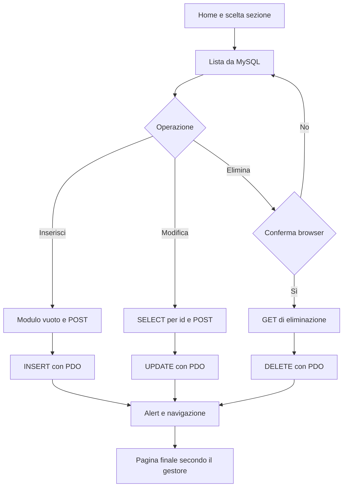

# Flussi operativi — CRUD PHP / PDO / MySQL

[README](README.md)

## Ambito

Flussi ricavati dai sorgenti disponibili il 8 ottobre 2026; verifica statica, senza eseguire scritture su MySQL. Il progetto gestisce allievi, lezioni e professori tramite pagine PHP. Non è presente un flusso di login nei file esaminati.

## Punto di ingresso e consultazione

L'utente apre [index.php](index.php) e sceglie dal menu la sezione desiderata.

| Sezione | Pagina e lettura | Risposta e seguito |
| --- | --- | --- |
| Allievi | [allievi_tab.php](allievi_tab.php): SELECT di id, nome, cognome, idlezione | Tabella HTML; l'utente sceglie inserimento, modifica o eliminazione |
| Lezioni | [lezioni_tab.php](lezioni_tab.php): SELECT delle lezioni | Tabella HTML e azioni sul record |
| Professori | [professore_tab.php](professore_tab.php): SELECT di professore e materia | Tabella HTML e azioni sul record |
| Allievi per lezione | [tab_lezioni.php](tab_lezioni.php): INNER JOIN tra allievi e lezioni, ordinato per lezione | Tabella di sola consultazione; nessuna modifica avviata dalla query |

Le pagine includono [dbconnection.php](dbconnection.php), preparano ed eseguono la query PDO, leggono i risultati e generano l'HTML. Se non ci sono righe, la tabella non contiene record. L'INNER JOIN non mostra allievi privi di una lezione corrispondente.

## Inserimento: ciclo completo

1. Dalla lista l'utente preme “Aggiungi”.
2. La pagina `*_insert_front.php` mostra il modulo; i campi richiesti usano la validazione HTML del browser.
3. L'utente invia il modulo con POST alla pagina `*_insert_back.php`.
4. PHP legge i valori di POST, prepara un INSERT con parametri PDO e lo esegue.
5. Se `lastInsertId() > 0`, la risposta contiene un alert JavaScript di successo e una navigazione alla lista.
6. Il browser richiede nuovamente la lista: il nuovo SELECT mostra il dato inserito.
7. Se l'id di inserimento non è positivo, viene mostrato un messaggio di mancato inserimento.

| Entità | Modulo | Gestore POST | Campi | Lista finale |
| --- | --- | --- | --- | --- |
| Allievo | [allievi_insert_front.php](allievi_insert_front.php) | [allievi_insert_back.php](allievi_insert_back.php) | Nome, cognome, idlezione | allievi_tab.php |
| Lezione | [lezione_insert_front.php](lezione_insert_front.php) | [lezione_insert_back.php](lezione_insert_back.php) | Lezione | lezioni_tab.php |
| Professore | [prof_insert_front.php](prof_insert_front.php) | [prof_insert_back.php](prof_insert_back.php) | Professore, materia | professore_tab.php |

## Modifica: caricamento, salvataggio e risposta

1. L'utente seleziona “Modifica” dalla lista; il link porta a `*_update_front.php?id=...`.
2. PHP converte l'id a intero, esegue un SELECT parametrizzato e precompila i campi.
3. Il modulo invia un POST alla stessa pagina, mantenendo l'id nell'URL.
4. PHP esegue l'UPDATE parametrizzato e restituisce un alert e un redirect JavaScript.

| Entità | Pagina | Destinazione dopo UPDATE |
| --- | --- | --- |
| Allievo | [allievi_update_front.php](allievi_update_front.php) | allievi_tab.php |
| Lezione | [lezione_update_front.php](lezione_update_front.php) | index.php |
| Professore | [prof_update_front.php](prof_update_front.php) | **fetch.php, assente dal repository** |

**Interruzione reale:** la modifica del professore può essere già salvata nel database quando la navigazione finale fallisce perché `fetch.php` non esiste. Tornare alla lista e verificare il dato prima di ripetere. Questa documentazione non corregge il redirect.

Per un id inesistente non risulta una pagina 404 applicativa dedicata: il SELECT non valorizza i dati attesi dal modulo. L'alert di modifica non verifica quante righe siano state effettivamente aggiornate.

## Eliminazione e annullamento

1. Nella lista l'utente preme “Elimina”.
2. Il browser chiede conferma con `confirm(...)`.
3. Se annulla, non parte la richiesta.
4. Se conferma, il browser invia un **GET** a `*_delete.php?del=...`.
5. PHP converte l'id a intero ed esegue il DELETE parametrizzato.
6. Restituisce alert e navigazione alla lista, che viene ricaricata.

Gestori: [allievi_delete.php](allievi_delete.php), [lezione_delete.php](lezione_delete.php), [prof_delete.php](prof_delete.php). Non c'è un cestino o un ripristino implementato. Vincoli e possibili effetti sulle relazioni dipendono dallo schema MySQL; non vengono inventati qui.

## Errori, automazioni e fine del ciclo

Il gestore di connessione intercetta `PDOException`; le operazioni CRUD non hanno un ciclo applicativo di retry, rollback coordinato o messaggi uniformi per gli errori SQL. I vincoli `required` sono controlli del browser, non un sistema completo di validazione sul server.

Le uniche azioni automatiche del ciclo sono query, generazione HTML, alert e navigazione JavaScript dopo la risposta. Se JavaScript non viene eseguito, la navigazione finale non avviene automaticamente. Non risultano notifiche email, processi schedulati, attività in background o GitHub Actions. Dopo la risposta PHP, l'operazione server termina.

## Verifica manuale suggerita

Su un database di prova: inserire e modificare ciascuna entità, annullare e confermare una cancellazione, aprire un id inesistente e controllare il redirect della modifica professore. Verificare la lista con join dopo aver cambiato `idlezione` di un allievo.
