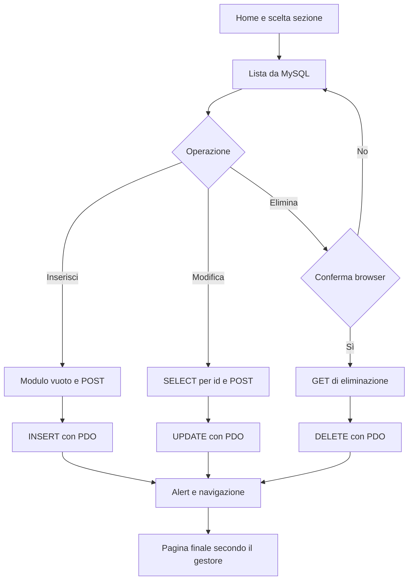

# CRUD_PHP_PDO_MYSQL_BOOTSTRAP

Applicazione didattica per la gestione di allievi, lezioni e professori. Utilizza PHP e PDO per l'accesso a MySQL e Bootstrap per l'interfaccia, con pagine dedicate a consultazione, inserimento, modifica ed eliminazione.

| Aspetto | Descrizione |
| --- | --- |
| Utilizzatore | Utente tramite browser |
| Punto di ingresso | index.php e menu delle sezioni |
| Risultato | Tabelle HTML e aggiornamenti MySQL |

## Indice

- [Funzionalità](#funzionalità)
- [Tecnologie e requisiti](#tecnologie-e-requisiti)
- [Configurazione](#configurazione)
- [Avvio](#avvio)
- [Flussi operativi](#flussi-operativi)
- [Verifiche](#verifiche)
- [Struttura e documentazione](#struttura-e-documentazione)

## Funzionalità

- Gestione delle anagrafiche degli allievi.
- Gestione delle lezioni e dei professori.
- Associazione degli allievi alle lezioni.
- Consultazione delle lezioni per studente.
- Operazioni SQL parametrizzate tramite PDO.

## Tecnologie e requisiti

**PHP**, **PDO con driver MySQL**, **MySQL** e **Bootstrap 5.3.0-alpha1**. Sono necessari un interprete PHP con pdo_mysql abilitato, un database con lo schema previsto e un browser. Bootstrap è caricato da CDN.

## Configurazione

[dbconnection.php](dbconnection.php) definisce host, nome database, utente e password e apre la connessione PDO. Configurare questi valori per un ambiente locale di prova senza pubblicare credenziali operative.

Le pagine utilizzano le seguenti tabelle e colonne:

| Tabella | Colonne utilizzate |
| --- | --- |
| `allievi` | `id`, `nome`, `cognome`, `idlezione` |
| `lezioni` | `id`, `lezione` |
| `professori` | `id`, `professore`, `materia` |

Il repository include lo script [classe.sql](classe.sql), con definizioni delle tabelle e dati di esempio. Prima dell'avvio, predisporre un database di prova coerente con lo script.

Lo schema deve supportare gli inserimenti con id generato e il collegamento `allievi.idlezione → lezioni.id`. Tipi, vincoli e regole di cancellazione devono essere verificati nello schema del database disponibile.

## Avvio

Predisporre MySQL e la connessione, quindi eseguire dalla radice:

~~~bash
php -S localhost:8000
~~~

Aprire `http://localhost:8000/index.php`. Il server integrato di PHP è indicato per l'esecuzione locale di sviluppo. In alternativa, servire la cartella del progetto da un ambiente PHP già configurato.

## Flussi operativi

I flussi descrivono il comportamento implementato, inclusi gli effetti parziali e le automazioni non attive. La ricostruzione si basa sull'analisi statica dei sorgenti dell'8 ottobre 2026; le verifiche proposte non costituiscono test già eseguiti.

### Indice dei flussi

- [Contesto operativo](#contesto-operativo)
- [Punto di ingresso e consultazione](#punto-di-ingresso-e-consultazione)
- [Inserimento: ciclo completo](#inserimento-ciclo-completo)
- [Modifica: caricamento, salvataggio e risposta](#modifica-caricamento-salvataggio-e-risposta)
- [Eliminazione e annullamento](#eliminazione-e-annullamento)
- [Errori, automazioni e fine del ciclo](#errori-automazioni-e-fine-del-ciclo)

### Contesto operativo

Il progetto gestisce allievi, lezioni e professori tramite pagine PHP. Non è presente un flusso di login nei file esaminati.

### Punto di ingresso e consultazione

L'utente apre [index.php](index.php) e sceglie dal menu la sezione desiderata.

| Sezione | Pagina e lettura | Risposta e seguito |
| --- | --- | --- |
| Allievi | [allievi_tab.php](allievi_tab.php): SELECT di id, nome, cognome, idlezione | Tabella HTML; l'utente sceglie inserimento, modifica o eliminazione |
| Lezioni | [lezioni_tab.php](lezioni_tab.php): SELECT delle lezioni | Tabella HTML e azioni sul record |
| Professori | [professore_tab.php](professore_tab.php): SELECT di professore e materia | Tabella HTML e azioni sul record |
| Allievi per lezione | [tab_lezioni.php](tab_lezioni.php): INNER JOIN tra allievi e lezioni, ordinato per lezione | Tabella di sola consultazione; nessuna modifica avviata dalla query |

Le pagine includono [dbconnection.php](dbconnection.php), preparano ed eseguono la query PDO, leggono i risultati e generano l'HTML. Se non ci sono righe, la tabella non contiene record. L'INNER JOIN non mostra allievi privi di una lezione corrispondente.

### Inserimento: ciclo completo

1. Dalla lista l'utente preme “Aggiungi”.
2. La pagina `*_insert_front.php` mostra il modulo; i campi richiesti usano la validazione HTML del browser.
3. L'utente invia il modulo con POST alla pagina `*_insert_back.php`.
4. PHP legge i valori di POST, prepara un INSERT con parametri PDO e lo esegue.
5. Se `lastInsertId() > 0`, la risposta contiene un alert JavaScript di successo e una navigazione alla lista.
6. Il browser richiede nuovamente la lista: il nuovo SELECT mostra il dato inserito.
7. Se l'id di inserimento non è positivo, viene mostrato un messaggio di mancato inserimento.

| Entità | Modulo | Gestore POST | Campi | Lista finale |
| --- | --- | --- | --- | --- |
| Allievo | [allievi_insert_front.php](allievi_insert_front.php) | [allievi_insert_back.php](allievi_insert_back.php) | Nome, cognome, idlezione | allievi_tab.php |
| Lezione | [lezione_insert_front.php](lezione_insert_front.php) | [lezione_insert_back.php](lezione_insert_back.php) | Lezione | lezioni_tab.php |
| Professore | [prof_insert_front.php](prof_insert_front.php) | [prof_insert_back.php](prof_insert_back.php) | Professore, materia | professore_tab.php |

### Modifica: caricamento, salvataggio e risposta

1. L'utente seleziona “Modifica” dalla lista; il link porta a `*_update_front.php?id=...`.
2. PHP converte l'id a intero, esegue un SELECT parametrizzato e precompila i campi.
3. Il modulo invia un POST alla stessa pagina, mantenendo l'id nell'URL.
4. PHP esegue l'UPDATE parametrizzato e restituisce un alert e un redirect JavaScript.

| Entità | Pagina | Destinazione dopo UPDATE |
| --- | --- | --- |
| Allievo | [allievi_update_front.php](allievi_update_front.php) | allievi_tab.php |
| Lezione | [lezione_update_front.php](lezione_update_front.php) | index.php |
| Professore | [prof_update_front.php](prof_update_front.php) | **fetch.php, assente dal repository** |

**Interruzione del flusso:** la modifica del professore può essere già salvata nel database quando la navigazione finale fallisce perché `fetch.php` non esiste. Tornare alla lista e verificare il dato prima di ripetere. Il redirect descritto corrisponde all'implementazione attuale.

Per un id inesistente non risulta una pagina 404 applicativa dedicata: il SELECT non valorizza i dati attesi dal modulo. L'alert di modifica non verifica quante righe siano state effettivamente aggiornate.

### Eliminazione e annullamento

1. Nella lista l'utente preme “Elimina”.
2. Il browser chiede conferma con `confirm(...)`.
3. Se annulla, non parte la richiesta.
4. Se conferma, il browser invia un **GET** a `*_delete.php?del=...`.
5. PHP converte l'id a intero ed esegue il DELETE parametrizzato.
6. Restituisce alert e navigazione alla lista, che viene ricaricata.

Gestori: [allievi_delete.php](allievi_delete.php), [lezione_delete.php](lezione_delete.php), [prof_delete.php](prof_delete.php). Non è presente un cestino o un ripristino implementato. Vincoli e possibili effetti sulle relazioni dipendono dallo schema MySQL; non sono definiti dalla logica PHP esaminata.

### Errori, automazioni e fine del ciclo

Il gestore di connessione intercetta `PDOException`; le operazioni CRUD non hanno un ciclo applicativo di retry, rollback coordinato o messaggi uniformi per gli errori SQL. I vincoli `required` sono controlli del browser, non un sistema completo di validazione sul server.

Le uniche azioni automatiche del ciclo sono query, generazione HTML, alert e navigazione JavaScript dopo la risposta. Se JavaScript non viene eseguito, la navigazione finale non avviene automaticamente. Non risultano notifiche email, processi schedulati, attività in background o GitHub Actions. Dopo la risposta PHP, l'operazione server termina.

## Verifiche

### Verifiche funzionali consigliate

Su un database di prova: inserire e modificare ciascuna entità, annullare e confermare una cancellazione, aprire un id inesistente e controllare il redirect della modifica professore. Verificare la lista con join dopo aver cambiato `idlezione` di un allievo.

## Struttura e documentazione

- [index.php](index.php): punto di ingresso.
- [dbconnection.php](dbconnection.php): accesso a MySQL.
- [classe.sql](classe.sql): schema e dati forniti con il progetto.
- Pagine *_tab.php, *_insert_*.php, *_update_front.php e *_delete.php: operazioni delle singole entità.
- [FLUSSI.md](FLUSSI.md): versione dedicata dei flussi riportati integralmente in questo README.
